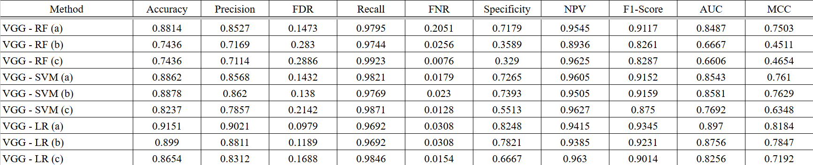
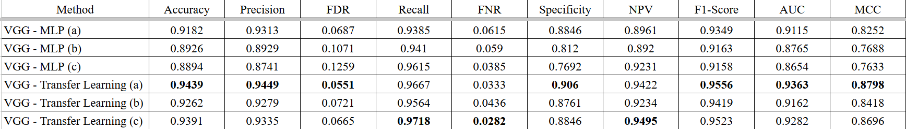

# A Deep Learning Approach for Pneumonia Diagnosis

Link for Dataset: [https://www.kaggle.com/datasets/paultimothymooney/chest-xray-pneumonia](https://www.kaggle.com/datasets/paultimothymooney/chest-xray-pneumonia)

## Project Information
Pneumonia is a severe lung infection that can be life-threatening if not diagnosed and treated promptly. Chest X-rays (CXR) are commonly used for pneumonia diagnosis, but manual interpretation by radiologists can be time-consuming and prone to human error. Recent advancements in deep learning have demonstrated remarkable performance in medical image analysis, particularly in detecting abnormalities in radiographic images.

Deep learning has revolutionized medical image analysis, enabling automated detection of diseases from radiographic images. However, raw chest X-ray images (CXR) often contain irrelevant regions that may introduce noise and reduce model performance. To address this issue, we integrate lung segmentation into the pneumonia diagnosis pipeline, ensuring that the deep learning model focuses only on the most relevant areas. 

Deep learning has shown significant potential in automating pneumonia diagnosis from chest X-ray (CXR) images. Among various convolutional neural network (CNN) architectures, VGG16 has proven to be highly effective in feature extraction and medical image classification. Our objective is to enhance diagnostic accuracy while maintaining a lightweight and efficient model. The integration of VGG16 with domain-specific preprocessing techniques, such as lung segmentation, aims to reduce false positives and improve model robustness, making it more applicable in clinical settings.

This study aims to conduct a comparative analysis of multiple classification techniques to determine the most effective approach for pneumonia detection. We evaluate some methods such as Random Forest, Support Vector Machine, Logistic Regression.

The most promising method in our study is Multilayer Perceptron (MLP), which achieved the best classification performance. Additionally, we conducted fine-tuning to enhance feature extraction models and improve overall efficiency. This optimization helps the network better capture relevant patterns in chest X-ray images, leading to more accurate pneumonia diagnosis.

